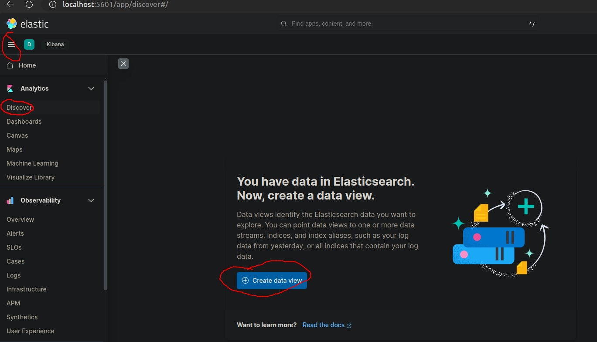
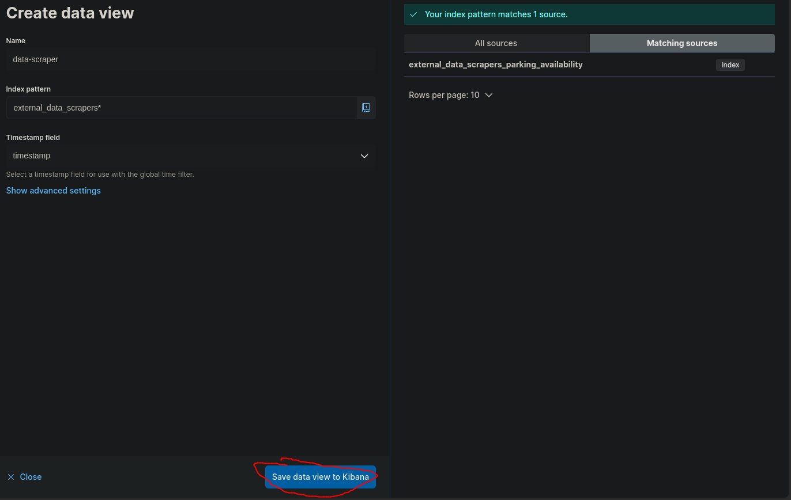

# External data scrapers

Repository for collecting data from publicly available data sources.

## Development

Using well known framework for extracting data from websites [Scrapy](https://scrapy.org/).

## Local development

The provided docker-compose file consist of Elasticsearch single node and
Kibana Dashboards, which is meant for storing the scraped data. 

### Starting OpenSearch single node

Using Elasticsearch cluster with docker-compose.yml

```
docker-compose up
```
or 
```
docker compose up
```
Depending on your docker setup.

You can now visit http://localhost:5601.

### Scrapers development environment

Setup virtual environment

```
python3 -m venv .venv-spiders
source .venv-spiders/bin/activate
pip install -r requirements.txt
```

Start the example scraper.

```
python main.py
```

The main script will query defined url in example scraper every minute.
The scraper also initialize Easticsearch index, so if you want to use Kibana to visualize data, you have to create `index pattern` after first
start of main.py the index will be created after approx 1min. 

1. Go to http://localhost:5601/
2. Click `Discover` and then `Create data view` (picture 1)
3. Type `external_data_scrapers*` and select Timestamp field `timestamp` (picture 2)
6. Click `Save data view to Kibana`






## About the Project

Project is part of DataScience@UL-FRI Project Competition 2023, organized by
[Medius d.o.o.](https://medius.si) and [FRI Data Science](https://datascience.fri.uni-lj.si/). 
